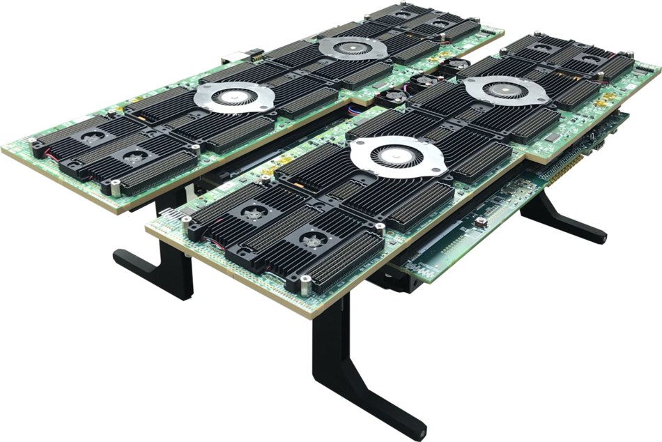

==============================
Virtex Ultrascale PCIe example
==============================

Copyright (c) 2021 `Antmicro <https://www.antmicro.com>`_

Overview
========

This repository is an example guide on how to build designs for the proFPGA VU19P and XCU1525 boards that use the PCIe interface.

It demonstrates an example configuration where the FPGA performs memory-to-memory transfers between two buffers in host PC memory.

Prerequisites
-------------

* Building designs for the VU19P board requires Xilinx Vivado 2020.2 or newer.
* A Vivado license is needed, ``xcvu19p`` and ``xcvu9p`` chips found on the supported boards are not supported by the free license.

Building the design
-------------------

#. Clone this repository
#. Run ``git submodule update --init --recursive`` to download all the required submodules
#. Adjust ``IP_ADDR``, ``LOGIN`` to point to user on a test machine which has the VU19P connected
#. Set the target board with the ``BOARD`` variable:

   .. code-block:: bash

      export BOARD=xcu1525
      # or
      export BOARD=profpga_xcvu19p

#. Set ``VIRTUALENV_DIR`` to specify the location for the Python virtual environment that will be created
#. Run ``make venv/create`` to create the Python venv
#. Run ``source $VIRTUALENV_DIR/bin/activate`` to activate the newly created venv
#. Run ``make venv/install`` to add the required dependencies to the venv
#. Run ``source <Vivado path>/settings64.sh`` to add Vivado to $PATH
#. Run ``make gateware/build`` to build the gateware
#. Run ``make software/build`` to copy the kernel module and userspace app sources to the target machine and build them

Running the design
------------------

Loading the bitstream onto the proFPGA device
+++++++++++++++++++++++++++++++++++++++++++++

#. Create a new project in proFPGA builder
#. Make sure that both ``FM-XCVU19P-R1`` and ``EB-PDS-PCIe-Cable-R3`` are detected (design assumes that PCIe board is attached to ``TA1``)
#. Configure clocks to provide a 300MHz reference clock on ``clk_1``
#. Load the ``build/profpga_xcvu19p/gateware/profpga_xcvu19p.bit`` bitstream onto the target device using the proFPGA tools

Loading bitstream onto xcu1525 board
++++++++++++++++++++++++++++++++++++

#. Connect a micro USB cable to the board
#. Load the ``build/xcu1525/gateware/xcu1525.bit`` bitstream onto the target device using Vivado or openOCD

Running host software
+++++++++++++++++++++

#. Run ``echo 1 | sudo tee /sys/bus/pci/rescan`` on the host PC to rescan PCIe devices
#. Using ``lspci`` check if a new LitePCIe device appeared, if it was not detected then:

   a. Check ``dmesg`` output to see if any PCIe errors appeared
   b. If errors similar to ``no space for [mem size 0x00a00000]`` are visible then you can try to remove the root port used by that slot using:
      ``echo 1 | sudo tee /sys/bus/pci/devices/<root-port-path>/remove`` and then doing a rescan

#. Once the device is visible you can load the driver by running ``sudo modprobe litepcie.ko`` on the host PC
#. Finally you can run the test application ``./litepcie_util dma_test``, it should be located in ``/home/$LOGIN/build/$BOARD/driver/user`` on the host PC
